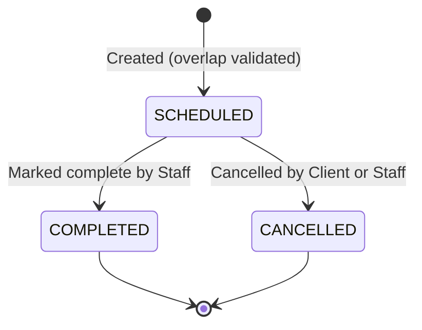

# Data Model: Appointment Booking System

This document specifies the database schemas, field definitions, relationships, and validation rules for the BarberTime database model.

---

## Abstract Base Model (Soft Delete)

All business models (except Django's built-in `User`) inherit from `SoftDeleteModel` to enforce Constitution Principle V.

### `SoftDeleteModel`
- **Fields**:
  - `is_active` (Boolean): Defaults to `True`.
- **Behavior**:
  - Overrides standard `delete()` method: performs logical delete by setting `is_active = False` and saving the instance.
  - A custom manager `ActiveManager` filters queryset results to return only instances where `is_active=True` by default. A separate manager `all_objects` is registered to access deleted records.

---

## Core Entities

### 1. `User` (Django Core `django.contrib.auth.models.User`)
Represents login credentials and basic permissions.
- **Fields**:
  - `id` (Auto-increment Primary Key)
  - `username` (CharField, unique): Login identifier. For Clients, this is their Phone Number. For Staff, a standard username.
  - `password` (CharField): Securely hashed password string.
  - `first_name` (CharField): Display name of the user.
  - `is_staff` (BooleanField): `True` for administrators/barbers; `False` for clients.
  - `is_active` (BooleanField): Standard Django account activation flag.

### 2. `Cliente`
Linked 1-to-1 with a standard Client User. Inherits from `SoftDeleteModel`.
- **Fields**:
  - `id` (Auto-increment Primary Key)
  - `user` (OneToOneField to `User`, on_delete=CASCADE)
  - `phone` (CharField, unique): Copy of user.username, kept for direct querying.
- **Relationships**:
  - 1-to-1 link to `User`.
- **Deactivation Cascade**:
  - When a `Cliente` is deactivated (`is_active = False`), the system automatically cancels all upcoming appointments associated with this client.

### 3. `Service`
Represents barbering services offered. Inherits from `SoftDeleteModel`.
- **Fields**:
  - `id` (Auto-increment Primary Key)
  - `name` (CharField, unique, max_length=100)
  - `description` (TextField, blank=True)
  - `duration` (IntegerField): Service duration in minutes. Must be greater than 0.
  - `price` (DecimalField, max_digits=8, decimal_places=2): Price of the service.
- **Validation Rules**:
  - Duration must be a positive integer (e.g., 30, 45, 60 minutes).
  - Price must be non-negative.

### 4. `Appointment`
Represents a booked slot for a client with a barber. Inherits from `SoftDeleteModel`.
- **Fields**:
  - `id` (Auto-increment Primary Key)
  - `client` (ForeignKey to `Cliente`, on_delete=PROTECT)
  - `barber` (ForeignKey to `User` (Staff), on_delete=PROTECT): The barber performing the service (must have `is_staff=True`).
  - `service` (ForeignKey to `Service`, on_delete=PROTECT)
  - `date` (DateField)
  - `start_time` (TimeField)
  - `end_time` (TimeField): Calculated automatically before saving as `start_time + service.duration`.
  - `status` (CharField): Choices are:
    - `'SCHEDULED'` (Default)
    - `'COMPLETED'`
    - `'CANCELLED'`
- **Relationships**:
  - Belongs to one `Cliente`.
  - Belongs to one `User` (Staff Barber).
  - Belongs to one `Service`.

---

## State Transition Diagram: `Appointment`

---

## Validation & Business Logic Rules

### 1. Booking Overlap Check
An appointment cannot overlap with any other active (non-cancelled and soft-active) appointment for the same barber.
- **Overlap Logic**:
  For a proposed appointment with `barber`, `date`, `start_time`, and calculated `end_time`:
  There must NOT exist any other `Appointment` $A$ where:
  - $A.\text{barber} = \text{barber}$
  - $A.\text{date} = \text{date}$
  - $A.\text{is\_active} = \text{True}$
  - $A.\text{status} \neq \text{'CANCELLED'}$
  - $A.\text{start\_time} < \text{end\_time}$ AND $A.\text{end\_time} > \text{start\_time}$

### 2. Operating Hours Check
Appointments must start and end within fixed operating hours:
- Earliest allowed start time: 9:00 AM
- Latest allowed end time: 8:00 PM

### 3. Active Barber Validation
The selected `barber` must be an active staff member (`is_staff=True` and `is_active=True`).

### 4. Soft-Deleted Service Check
New appointments cannot be booked with a service that has `is_active=False`.
